# Suport
Suport is a web application that empowers users to create, read, update, and delete sports posts for football, rugby, and Formula 1. Built using HTML, CSS, JavaScript, Python with Flask, and PostgreSQL, Suport is a versatile platform that allows sports enthusiasts to share their insights and opinions. Whether you want to publish posts, explore others' perspectives, or manage your own content, Suport provides the tools and features to help you do just that. This project aims to inform readers about its capabilities, offering a dynamic and user-friendly environment for sports enthusiasts to interact and engage with sports posts effortlessly.

This is Milestone Project 3 for a Level 5 Diploma in Web Application Development.    

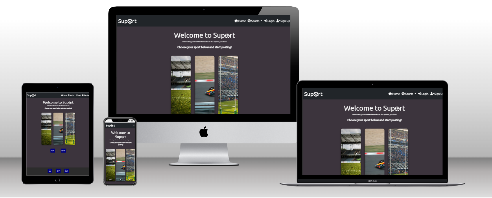  

Link to live site: https://suport-mp3-51225a2ca7c0.herokuapp.com/

## CONTENTS

* [User Experience](#user-experience-ux)
  * [User Stories](#user-stories)

* [Design](#design)
  * [Colour Scheme](#colour-scheme)
  * [Typography](#typography)
  * [Layout](#layout)
  * [Imagery](#imagery)
  * [Wireframes](#wireframes)
  * [Data Model](#data-model)
  * [Security](#security)
  * [Future Updates](#future-updates)

* [Features](#features)
  * [Future Implementations](#future-implementations)
  * [Accessibility](#accessibility)

* [Technologies Used](#technologies-used)
  * [Languages Used](#languages-used)
  * [Frameworks, Libraries & Programs Used](#frameworks-libraries--programs-used)

* [Testing](#testing)

* [Deployment](#deployment)

* [Credits](#credits)
  * [Code Used](#code-used)
  * [Content](#content)
  * [Media](#media)
  * [Acknowledgments](#acknowledgments)
  
  ---

## User Experience (UX)  

### User Stories

**User Story 1:** 
As an amateur football fan, I want to sign up easily and quickly to share my thoughts and opinions on recent football matches and events. I hope to find a welcoming community where I can learn more about the sport and improve my understanding.

**User Story 2:** 
As a committed sports fan, I'm eager to engage with other enthusiasts across various sports. I want to explore high-quality reviews and discussions on football, rugby, and Formula 1. I hope to connect with fellow fans and contribute to lively conversations on Suport.

**User Story 3:** 
As a regular user of sports blog sites, I'm looking for a platform that offers a seamless experience for reading and interacting with sports content. I want to easily discover and read detailed posts and articles on my favourite sports without any hassles.

**User Story 4:** 
As a sports super blogger who contributes to multiple sports blogs, I'm excited to leverage Suport's features to reach a broader audience. I aim to share my in-depth knowledge and analysis of football, rugby, and Formula 1, engaging with a diverse community of sports enthusiasts across the platform.

## Design  

### Colour Scheme

Initial colour scheme is general dark theme for a contemporary look, I have included navy blue and white as accent colours which will also provide good accessibility scores.  

### Typography

The font used throughout the site is 'Ubuntu', I have chosen this font because I consider it to be clean and easy to read.  

### Layout

The layout of the Suport website is built using the Bootstrap framework, which provides a responsive grid system that allows the website to adapt to different screen sizes and devices. The use of a grid system helps to create a consistent layout on necessary pages of the website, which makes navigation and exploration more intuitive for visitors.  

### Accessibility  

The site has scored highly in terms of accessibility, I have included alt text descriptions for all images to provide context and information to visually impaired users, Used contrasting colours to enhance accessibility. 
 

### Imagery  
Used a combination of imagery from Pixabay (See media below) and an image that i had taken myself. Images are all of a similar size and quality for consistency throughout the site.  

### Wireframes

[Suport Wireframe](README-images/suport-mp3-wireframe.pdf "Link to Suport wireframe")  
There have been some changes since the wireframe was created. The initial plan for the site was for users to be able to create an account and make posts about sports. The general principle remains the same, I have just added a comment ability to the posts and implemented a user profile that includes the users 'Favourite Sport' and 'Favourite team', they can also add a bio.  

### Data Model  

See database schema [here](README-images/database-schema-mp3.pdf "Link to Suport database schema")

**User to Posts**  
- One to Many.  
- One user can have multiple posts.  
- User object will have a posts property that queries all related posts.
  
**Post to User**  
- Many to One.  
- Each post belongs to one user.  
- Post will have a user property to query the related user object.  

**Post to Comments**  
- One to Many.  
- One post can have multiple comments.  
- Post has a comments property to get all comments.  

**Comment to Post**  
- Many to One.  
- Each comment belongs to one post.  
- Post property on Comment to access that post.
  
**User to Comments**
- One to Many.  
- A user can make many comments.  
- User has comments property to fetch all comments.  

**Comment to User**
- Many to One.  
- Each comment has one user who authored it.  
- User property gives that user object.

### Security  

A number of different security considerations were taken into account when putting together this project.  

**Use of .env file**  
Important credentials including DATABASE_URL and SECRET_KEY are located within .env file which is subsequently in a .gitignore file to ensure it remains secure. SECRET_KEY was initially located in __init__.py file, it has since been changed and moved to a more secure location in .env file.  

**Defensive Programming**  
Measures have been put in place throughout the site to prevent users from doing things they are not authorised to do. For example, A user who has not signed up to the site, cannot access any of the individual sports pages to add a post. This has been implemented using @login_required decorators.  

**Password Hashing**  
Passwords are not stored in plaintext in the database. Instead, they are hashed using the generate_password_hash function from Werkzeug. The hashing method specified is sha256, which is a cryptographic hash function. When checking if a provided password is correct, the check_password_hash function is used. This function hashes the input password and compares it to the stored hash to verify authenticity without ever exposing or comparing the plaintext passwords.  

**Input Validation**  
The code checks if the email already exists in the database to prevent duplicate registrations. Validation checks on the length of the email, username, and password ensure that users provide sufficiently complex information. Passwords entered during the registration process are confirmed by having the user enter them twice. If they don't match, an error is shown.  

**Feedback to Users**  
Flash messages provide feedback to users about the status of their actions. For example, 'successful login or reasons for authentication failure'. However, care is taken not to provide overly specific errors. For example, rather than saying "incorrect password for given email," the feedback messages are generalised like 'Email does not exist' or 'Incorrect password, try again.'  

### Future updates  
- Adding more sports.
- Adding message feature between users.
- Adding an API that imports sports data for user to post about.

## Features

### General features  
**Sign up**  
Users have the ability to sign up, choosing their favourite sport and team in the process.  

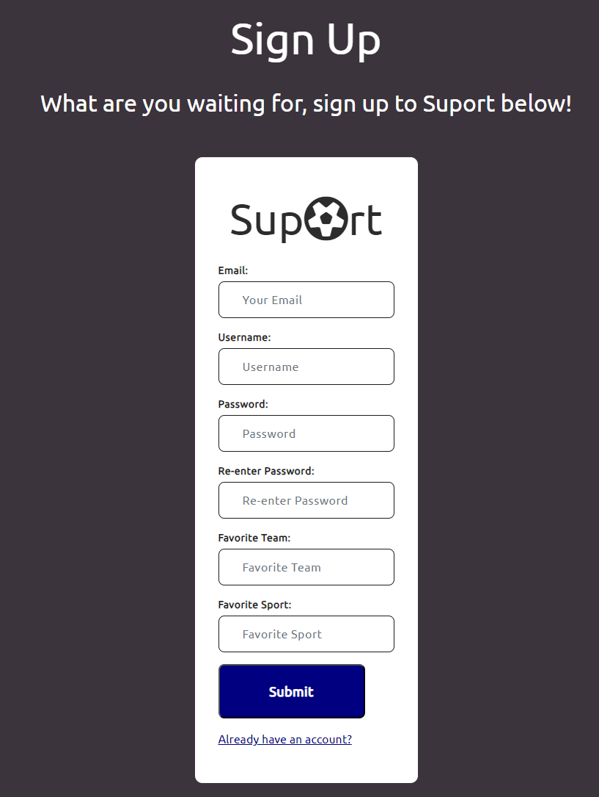

**Log in**  
Users can login using the information that they provided at the sign up process.  

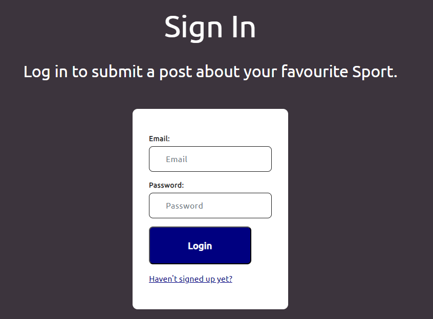

**Overview page**  
Users are presented with an overview page that includes interactive images of the 3 sports that the site currently facilitates (Football, Formula 1 and Rugby). When users hover over the images, they expand causing more of the image to be visible, leading to a better user experience. This is hidden on smaller screens and replaced with an image carousel.  

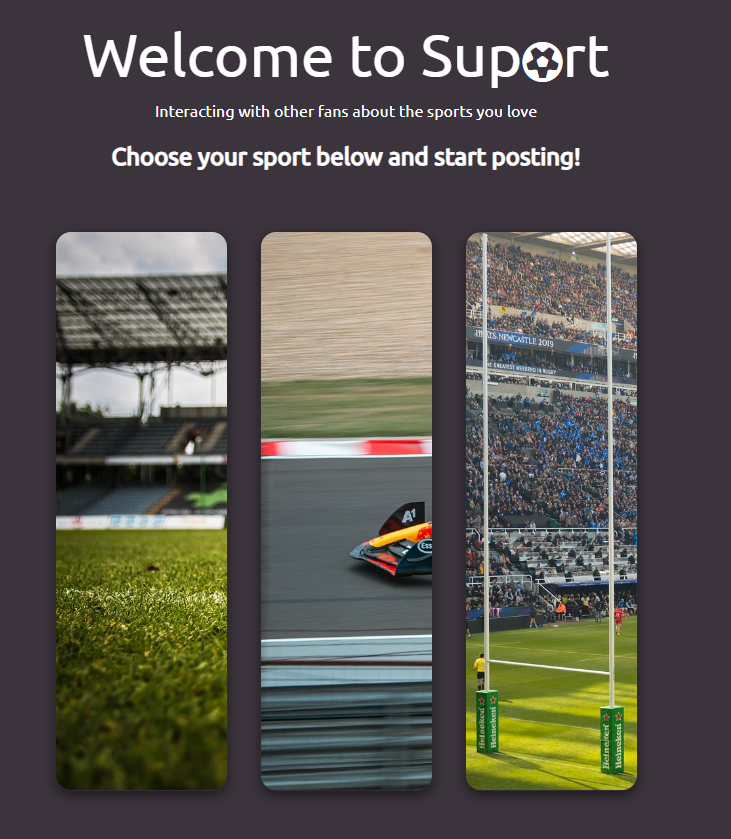

**Image Carousel**  
A Bootstrap image carousel was used on individual sports pages to enhance user experience.  

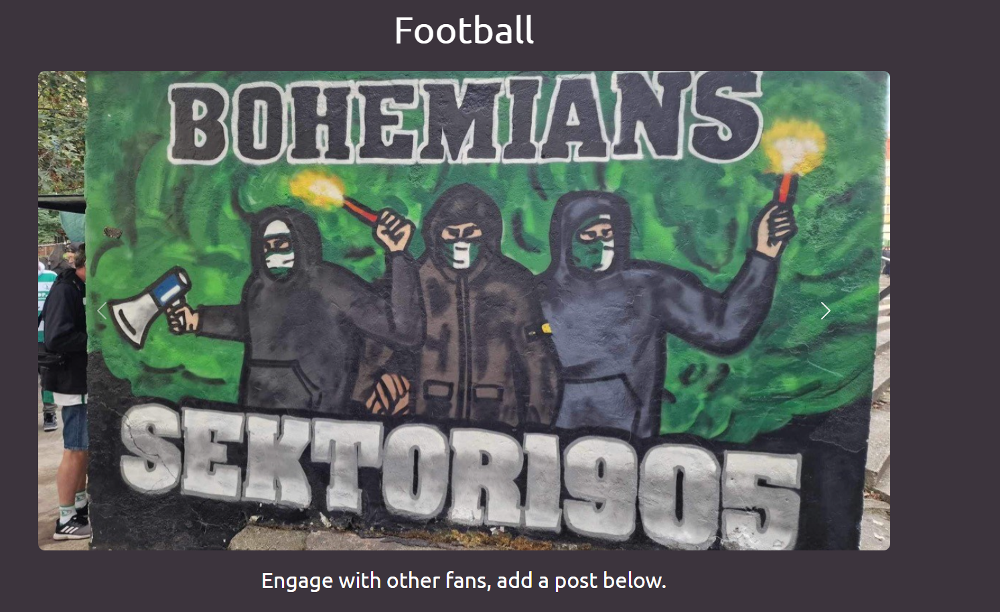

**Football page**  
Individual sport page where users can go to post and interact with other users about Football.

**Formula 1 page**  
Individual sport page where users can go to post and interact with other users about Formula 1.  

**Rugby page**
Individual sport page where users can go to post and interact with other users about Rugby.  

**Post feature**  
Users can post content onto individual sports pages, they can also browse other posts that users have already posted.  

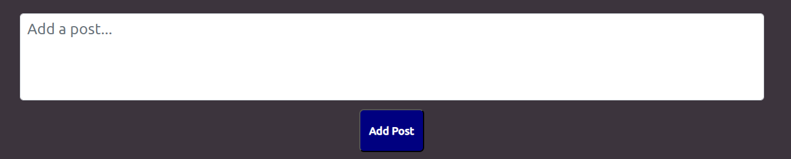

**Comment feature**  
Users can comment on posts made by themselves or other users, comments can be deleted once they have been added.  

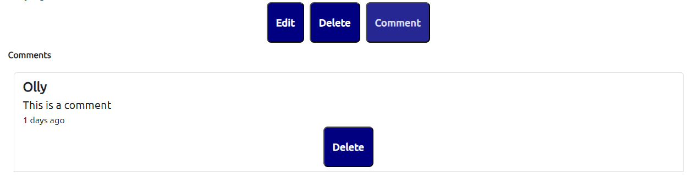

**Delete modal**  
Users can delete posts and comments once they have added them. A confirmation 'delete modal' is displayed once the user clicks the 'delete' button.  

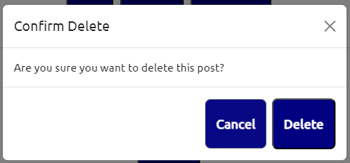

**My profile**  
Users can navigate to the 'My profile' page, here they can add to their bio, change their favourite team/sport that is displayed on their profile page. They can also views historic posts/comments.  

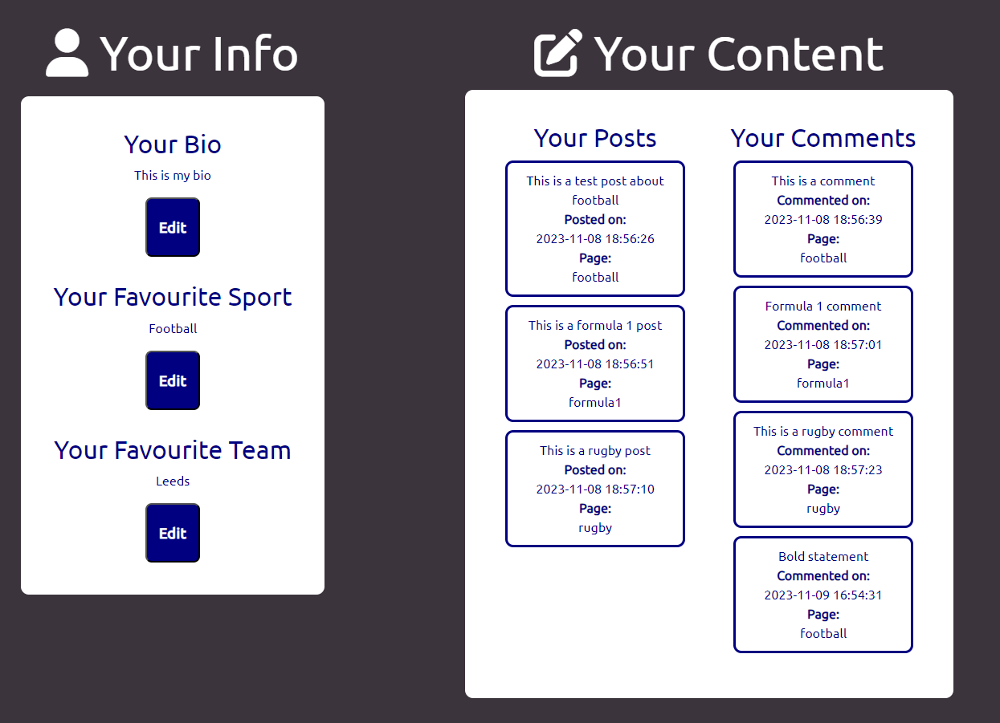

**Other Users**  
Users have the ability to navigate to the 'Other users' page to view the other users that have created accounts. Users can see other users information such as username, Favourite Team and Favourite Sport.  

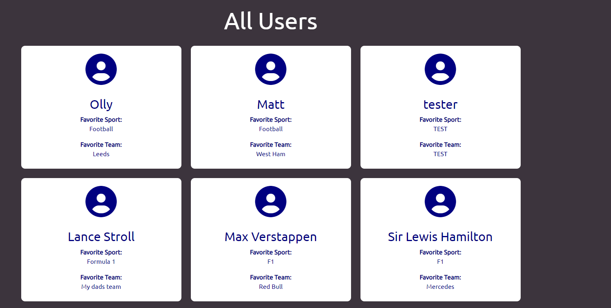

**Logout**  
Once users are finished on the site, they can click click the logout button which will take them to the overview page.  

**Footer**  
Users can navigate to respective social media sites that are present in the footer. On non-touchscreen devices, an animation has been added causing the icons to rotate utilising SVG.  

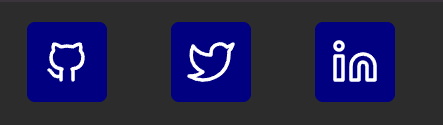  

**Flash Messages**  
I chose to use flash messages as a positive feedback to users whenever they made an action on the site. Everything from logging in, to adding a post to try something they aren't authorised to do.   
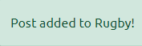  

**Creative timestamping**  
I decided to included a timestamp that informed users how long ago something was rather than a full dated timestamp, I chose this to enhance user experience.  
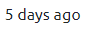

### Future Implementations
There are a number of different features that could be implemented in the future;
- API that displays live/historic sports data.
- Private messaging function that allows users to message directly.
- More interactive profiles that allow users to upload images and other content.
- The ability to view other users profiles.  

## Technologies Used

### Languages Used

**HTML5**  
Used for creation of markup for the website content.  
**CSS**  
Cascading style sheets used to style the individual pages.  
**Javascript**  
Used to toggle visibility of certain aspects of the site.  
**Python**  
Used to run the app.  

### Frameworks, Libraries & Programs Used

[Bootstrap 5.3.0](https://getbootstrap.com/)  
Boostrap was predominantly used throughout the site for responsiveness, modals to confirm deleting posts/comments and image carousel.

[CDN jsdelivr](https://www.jsdelivr.com/)  
CDN jsdeliver was used to serve static assets bootstrap and jquery to improve performance and reliability.

[Google Fonts](https://fonts.google.com/)  
Used to import 'Ubuntu' font.  

[Font awesome](https://fontawesome.com/)  
Used to import icons on to the site to improve user experience.  

[Github](https://github.com/)   
GitHub is used to store the projects code after being pushed from Git.  

[Balsamiq](https:/balsamiq.com)  
Balsamiq was used to create the wireframes during the design process.  

[Heroku](https://id.heroku.com/login)  
Used to deploy the project.  

[Flask](https://flask.palletsprojects.com/en/3.0.x/#)  
Python framework that has provided tools and features to build my web application.  

[Jinja](https://jinja.palletsprojects.com/en/3.1.x/)  
Assisted me in generating dynamic HTML content based on templates and data.  

[PostgreSQL](https://www.postgresql.org/)  
Hosted the database used in my project.  

[Visual Studio Code](https://code.visualstudio.com/download)  
Visual Studio Code was use to create files pages and where i produced the code for the project.  

[Google Chrome Dev Tools](https://developer.chrome.com/docs/devtools/)    
Google Chrome Dev Tools was used during the testing phase to test the responsiveness of the site and to check for any bugs.

[Pixabay](https://www.pixabay.com/)  
Pixabay was used to source images used throughout the individual sports pages and overview page.  
 
[W3schools](https://www.w3schools.com/)    
W3schools was used as a guide for HTML, CSS and Python basic principles.  

## Testing 
Testing process can be found [here](https://github.com/ojalaw/suport_MP3/blob/main/TESTING.md) 

## Deployment

**How was this site deployed?**

The website was initially deployed on Heroku.

**Deploying on Heroku**  
The following steps will need to be taken to deploy the application using Heroku.

- Create a requirements.txt file.  
- Create a Procfile by typing echo web: python app.py > Procfile. Ensure it starts with a capital P.  
- Go to Heroku. Log in or create an account.  
- Click the 'New' button and click 'Create new app'.  
- Enter a unique name for your project with no capital letters or spaces and select your region. Click 'Create App'.  
- Inside your project, go to the Resources tab and create a Heroku Postgres Database.  
- Inside your project, go to the 'Settings' tab. Scroll down and click 'Reveal Config Vars'.  
- Add in the following variables.
   - SECRET_KEY : Your secret key
   - DATABASE_URL: your postgres database URL
- Deploy your project by going to the Deploy tab and choose 'Connect to Github'
- Find your repository name and select Connect.

**Create a new repository on GitHub**  
- Add the necessary files to the repository.
- Go to the settings page of the repository, located on the menu bar towards the top of the page, scroll down to the GitHub Pages section which is located at the bottom of the 'Code and automation' sub-section.
- Select the main branch and the root folder, then click save.
- The website will now be live at the URL provided in the GitHub Pages section.

**How to clone the repository**

- Go to the (https://github.com/ojalaw/suport_MP3)  repository on GitHub.
- Click the "Code" button to the right of the screen, click HTTPs and copy the link there.
- Open a GitBash terminal and navigate to the directory where you want to locate the clone.
- On the command line, type "git clone" then paste in the copied url and press the Enter key to begin the clone process.  

**How to Fork the repository**  

- Go to the https://github.com/ojalaw/suport_MP3 repository on GitHub.
- Click on the 'Fork' option towards the top left of the page.  
- Click the dropdown button and click 'create a new fork'.  
- This will bring up a page with details of the repository, fill in boxes as required.
- Click 'create fork'.  

For further guidance [click here](https://docs.github.com/en/get-started/quickstart/fork-a-repo)  

Forking this repository will allow changes to be made without affecting the original repository.

## Credits

### Code Used

Bootstrap v5.3.0  
- Image carousels used from bootstrap.
- Delete Modal used from bootstrap.  

Code Institute training material  

Followed front-end tutorials from [Atheros] https://www.youtube.com/@Atheroslearning for footer and overview cards.
- Code referenced in html and CSS files that was inspired by Atheros learning.  

Followed tutorials from [Corey Schafer](https://www.youtube.com/@coreyms) to better understanding.  

Followed tutorials from [Tech with Tim](https://www.youtube.com/@TechWithTim) to understand flask.  

Used [Flask tutorials](https://flask.palletsprojects.com/en/2.3.x/tutorial/views/) to better understanding.  

### Content

###  Media

**Images**  

football - Image by Michal Jarmoluk from Pixabay  
https://pixabay.com/photos/soccer-ball-stadium-field-488700/  
Formula 1 - Image by Sandor Foszto from Pixabay  
https://pixabay.com/photos/red-bull-verstappen-f1-formula-1-8143008/  
Rugby - Image by Kate Baucherel from Pixabay  
https://pixabay.com/photos/rugby-heineken-cup-saracens-4498376/  
football-pitch - Image by congerdesign from Pixabay  
https://pixabay.com/photos/football-pitch-playing-field-stadium-4994688/  
formula1-wing - Image by Toby Parsons from Pixabay  
https://pixabay.com/photos/f1-formula-1-car-f1-car-mercedes-3169297/  
formula1-mcclaren - Image by Guy from Pixabay  
https://pixabay.com/photos/lando-norris-formula-one-race-6633950/  
wilko - Image by patrick Blaise from Pixabay  
https://pixabay.com/photos/rugby-velodrome-stadium-marseille-573459/  
rugby2 - Image by Monica Volpin from Pixabay  
https://pixabay.com/photos/rugby-players-world-cup-stadium-1210842/  
bohemka  
Personal image taken by myself  
  
###  Acknowledgments

Code Institute training material  
Mentor - Chris Quinn  

