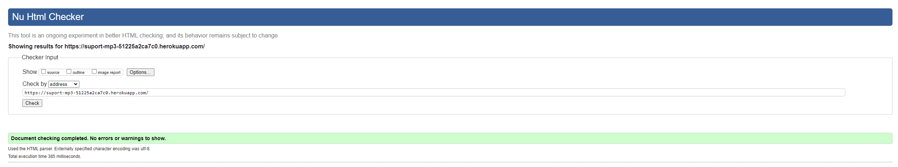
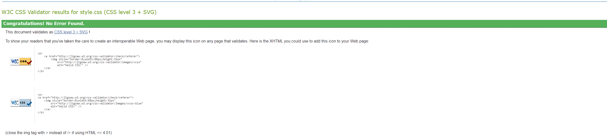
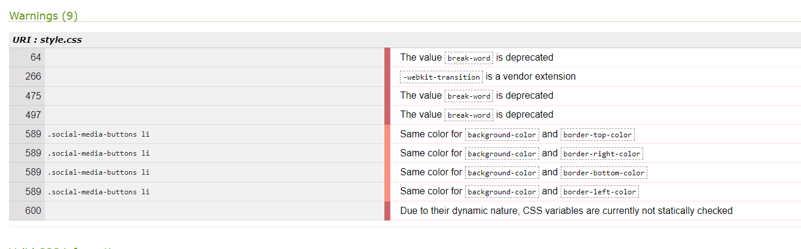
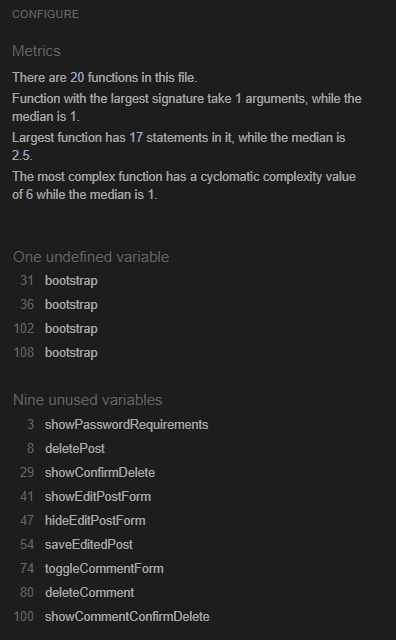
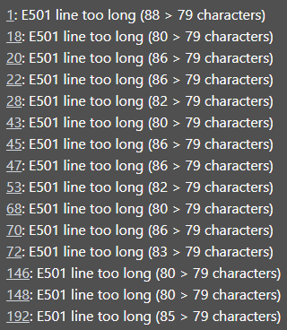
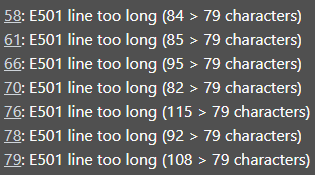
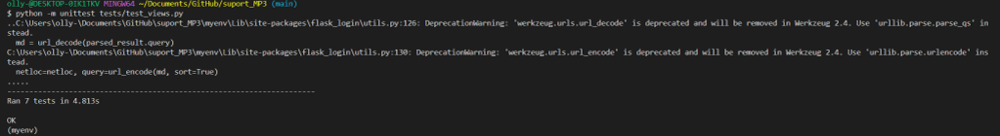

# Testing

## Contents

This site has been tested using the following testing procedures

* [Code Validation](#Code-validation)  

* [Lighthouse Testing](#Lighthouse-Testing)

* [Browser Compatibility](#Browser-Compatibility)

* [Automatic Testing](#Automatic-Testing)

* [Manual Testing](#Manual-Testing)

* [Bug Reporting](#Bug-Reporting)

## Code Validation    

The site has been run through [W3C](https://validator.w3.org/), [WC3 CSS](https://jigsaw.w3.org/css-validator/), [JSHint](https://www.jslint.com/) javascript validator and CI [PEP8 validator](https://pep8ci.herokuapp.com/) 

**HTML** 

  

No warnings/errors were present when running my site through W3C validator.  

**CSS**

  

No errors were present when running my site through W3C CSS validator.  

  

There were 9 warnings, none of which affect accessibility or functionality of site. I intend to implement changes in future.  

**Javascript**

  

There were no errors when running javascript file through JShint validator.  

**Python**

There were no errors when running python files through pep8 validator, however there were some warnings about characters exceeding 79 on views.py, auth.py and init.py. There were also no errors present in the terminal or console.  

  
Views.py warnings.  

  
Auth.py warnings.  

  
init.py warnings.

## Lighthouse Testing  

All pages passed lighthouse testing scoring particularly highly throughout.  

**Sign up**  
Desktop lighthouse score [here](README-images/sign-up-desktop-lighthouse.png "Optional title")  

Mobile lighthouse score [here](README-images/sign-up-mobile-lighthouse.png "Optional title")  

**Sign in**  
Desktop lighthouse score [here](README-images/login-desktop-lighthouse.png "Optional title")  

Mobile lighthouse score [here](README-images/login-mobile-lighthouse.png "Optional title")  

**Overview**  
Desktop lighthouse score [here](README-images/overview-desktop-lighthouse.png "Optional title")  

Mobile lighthouse score [here](README-images/overview-mobile-lighthouse.png "Optional title")  

**Football**  
Desktop lighthouse score [here](README-images/football-desktop-lighthouse.png "Optional title")  

Mobile lighthouse score [here](README-images/overview-mobile-lighthouse.png "Optional title")  

**Formula 1**  
Desktop lighthouse score [here](README-images/f1-desktop-lighthouse.png "Optional title")  

Mobile lighthouse score [here](README-images/f1-mobile-lighthouse.png "Optional title")  

**Rugby**  
Desktop lighthouse score [here](README-images/rugby-desktop-lighthouse.png "Optional title")  

Mobile lighthouse score [here](README-images/rugby-mobile-lighthouse.png "Optional title")  

**Profile**  
Desktop lighthouse score [here](README-images/profile-desktop-lighthouse.png "Optional title")  

Mobile lighthouse score [here](README-images/profile-mobile-lighthouse.png "Optional title")  

**All Users**  
Desktop lighthouse score [here](README-images/all-users-desktop-lighthouse.png "Optional title")  

Mobile lighthouse score [here](README-images/all-users-mobile-lighthouse.png "Optional title")  

## Browser Compatibility 
  
**Desktop**  

| Browser            | Version                                               | Bugs  |
| -------------      |:-------------:                                        | -----:|
| Google Chrome      | Version 112.0.5615.138 (Official Build) (64-bit)      | None  |
| Microsoft Edge     | Version 112.0.1722.58 (Official build) (64-bit)       | None  |
| Firefox            | 112.0.1 (64-bit)                                      | None  |  

**Mobile**  

| Device                   | Operating system | Bugs  |
| -------------            |:-------------:   | -----:|
| iPhone 14                | iOS 16.6.1       | None  |
| iPhone 14 pro            | iOS 16.6.1       | None  |
| iPad 10                  | iOS 16.6         | None  |
| Samsung Galaxy S22 ultra | Android 14.0     | None  |
| HONOR Magic5 Pro         | Android 13.0     | None  |
| iPhone 13 pro            | iOS 16.6         | None  |

## Automatic Testing  
I decided to employ a certain degree of automated testing during the project in the form of unittest, the python built-in module for writing/testing. The tests can be found in the test_views.py file and are summarised below.  

**Sanity Testing**  
The SanityTest class contains a basic sanity test. It verifies fundamental functionality by testing a simple addition function (add_numbers). This ensures that the most basic operations of the environment are working as expected.  

**Feature Testing**  
The TestPostFeature class performs feature testing for creating posts and adding comments. It tests the functionality of the application's features by sending POST requests to the routes handling post creation (/football-post) and comment addition (/add-comment/football/1). It checks if the correct status code (302, indicating a redirect) is returned, which implies successful execution of these features.  

**Endpoint Testing**  
The TestOverviewRoute and TestSportsRoutes classes are focused on endpoint testing. They test various routes of the application to ensure they are functioning as expected:  

TestOverviewRoute tests the main overview route ('/'), verifying that it returns a 200 status code and contains specific content in the response.  
TestSportsRoutes tests several sports-related routes (/football-post, /formula1-post, /rugby-post). It checks that these routes return a 302 status code and redirect to the login page, indicating that the routes are accessible but require user authentication.  

  

## Manual Testing  

During the manual testing, I tested the sites functionality, usability and responsiveness.  

I have kept the basic functionality of the site the same throughout the entire project. Initially leaning towards a note/review site, moving towards a social media site that allows users to create, edit and delete posts.  

**Overview page**  
During the manual testing phase, I changed the images on the overview.html page. A test user suggested that the images could not be seen clearly and a change would make it a better user experience. Due to this feedback, I transitioned to a bootstrap image carousel, like what is used on individual sports pages.  

**Sports pages**
Similarly to the overview page, during testing, i felt that the individual sports pages were rather static and needed something to add interest. I added the bootstrap carousel to allow users to see multiple images relating to the chosen sport.  

**Profile**  
Another change made while testing the site was the introduction of a 'Bio', 'Favourite team' and 'favourite sport'. I included these to give users a chance for them to input their preference and give them the opportunity to see other users and the sort of fans that the site attracts.  

#### Functionality

**General**

Navbar links - All navbar links work as expected.  
Sign up - Signup works as expected with errors handled as expected.  
Login - Login works as expected.  
Flash messages - All flash messages are correctly implemented, both success and error flash messages are displayed correctly.  
Overview cards - The interactive sports cards work as expected on the overview page.  
Image carousels - The image carousels work as expected on individual sports pages and on the overview page on smaller devices.  

**Sports pages** 

Post function - The post feature works as expected.  
Edit Post - Edit post feature works as expected.  
Delete Post - Delete post works as expected.  
Comment - The comment feature works as expected.  
Delete Comment - The delete comment feature works as expected.  

**Profile**

Edit Bio - The edit bio feature works as expected.  
Edit fav team - The edit fav team works as expected.  
Edit fav sport - The edit fav sport works as expected.  
Save/cancel button - The save and cancel buttons both work as expected.
Social media footer - The social media icons work as expected, responding on hover and opening new tab.  
Delete modal - The delete modal opens as expected and deletes content when clicked.  
Logout - The logout feature works as expected.  

**Usability**  

- As previously mentioned, users felt that different images could have been used on the overview page, I implemented an image carousel on mobile devices.  

**Responsiveness**  

I used the following break points for responsiveness.  

- 450px  
- 768px  
- 992px  
- 1200px

Generic bootstrap breakpoints were also used sporadically throughout the site.  

## Bug Reporting
Throughout the development phase of the site, I came across a variety of different bugs/errors that eventually overcame.  

- When I added the 'Favourite Sport' and 'Favourite Team' to the database, there were issues with migration and i was displayed with a 500 internal server error. To correct this, i reset the database.

- When adding 'Favourite Sport' and 'Favourite Team', I did not include them in my auth.py, so when users were signing up, they were not being added to the database.   

- When deploying to heroku for the first time, I was encountered with a 500 internal server error. This time it was due to trying to connect to a local database rather than my PostgreSQL Heroku database.  

- One issue that i had very early on was conflicting packages/modules to do with flask. To get around this, I used older versions of different modules to deconflict the issue. I have been displayed with the following message multiple times. C:\Users\olly-\Documents\GitHub\suport_MP3\suport\auth.py:19: UserWarning: The 'sha256' password method is deprecated and will be removed in Werkzeug 2.4. Migrate to the 'scrypt' method. Moving forward I would intedn to use the most up to date modules, it was just not possible for me this time.  

- A bug that was noticed during testing was that when posts containing words that contained a lot of characters were posted/commented, they overflowed their div. To correct this, I used the following CSS 'word-break: break-word;'  

- Clicking 'cancel' button on profile page was causing content to save and reveal flash message, I added javascript to handle the toggle reveal/hide.  

- Buttons too small on mobile devices, changed width to 100%.  

- Duplicated usernames were allowed, applied same logic as email to prevent users to sign up with usernames already in the database.  

- Users were being logged in automatically rather than being redirected to the login page, I added code to direct users to the login page.  

- When 'Favourite Team' and 'Favourite Sport' were over the 25 character limit, it caused 500 Internal server error. Added code to handle the error.

- Changed from interactive image cards to image carousel on overview page on smaller screens.

[Back to README.md](https://github.com/ojalaw/suport_MP3)
