# Testing

## Contents

This site has been tested using the following testing procedures

* [Code Validation](#Code-validation)  

* [Lighthouse Testing](#Lighthouse-Testing)

* [Browser Compatibility](#Browser-Compatibility)

* [Automatic Testing](#Automatic-Testing)

* [Manual Testing](#Manual-Testing)

* [Bug Reporting](#Bug-Reporting)

## Code Validation    

The site has been run through W3C, WC3 CSS validators and JSHint javascript validators.  

  

No warnings/errors were present when running my site through W3C validator.  

  

No errors were present when running my site through W3C CSS validator.  

  

There were 9 warnings, none of which affect accessibility or functionality of site. I intend to implement changes in future.  

  

There were no errors when running javascript file through JShint validator.  

## Lighthouse Testing  

All pages passed lighthouse testing scoring particularaly highly throughout.  

**Sign up**  
Desktop  

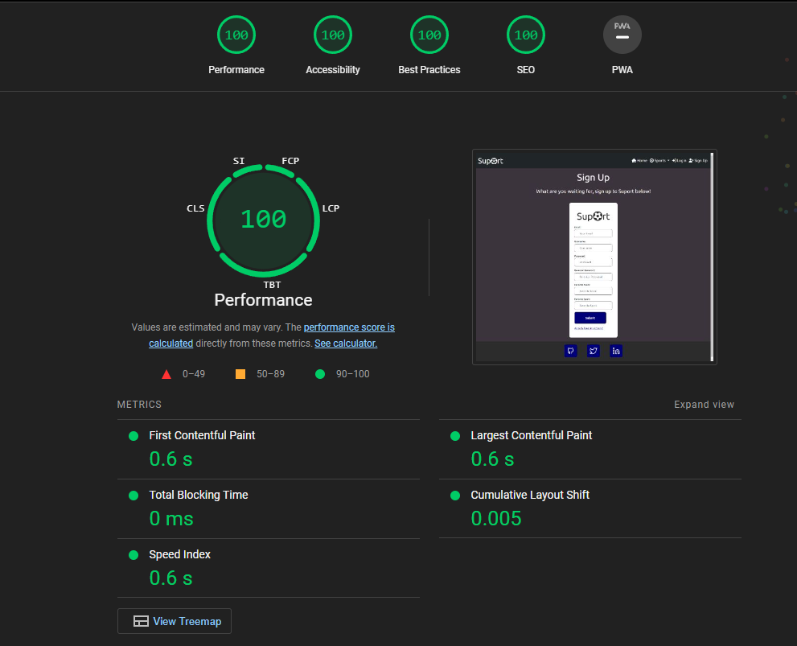  

Mobile  

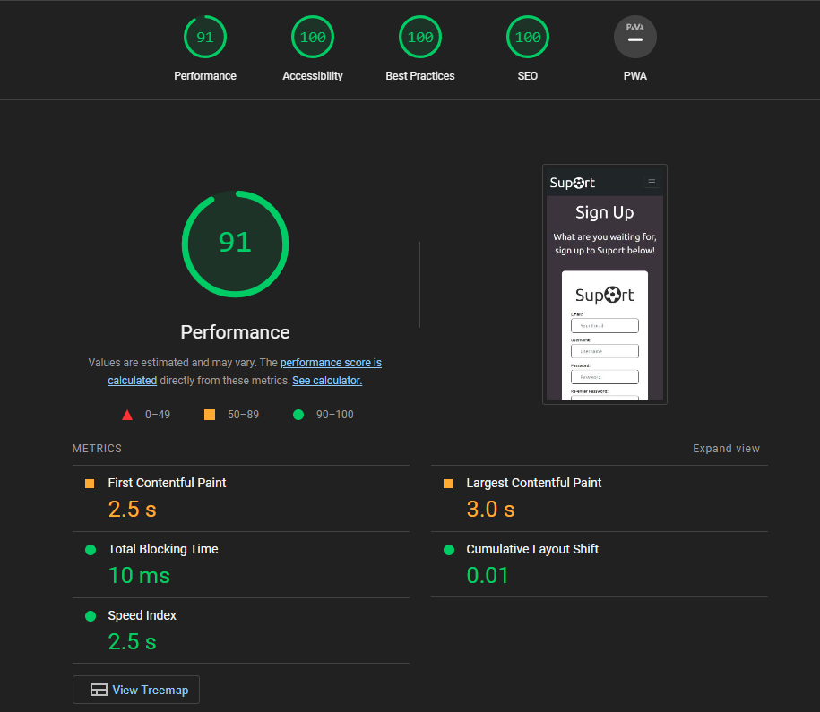  

**Sign in**  
Desktop  
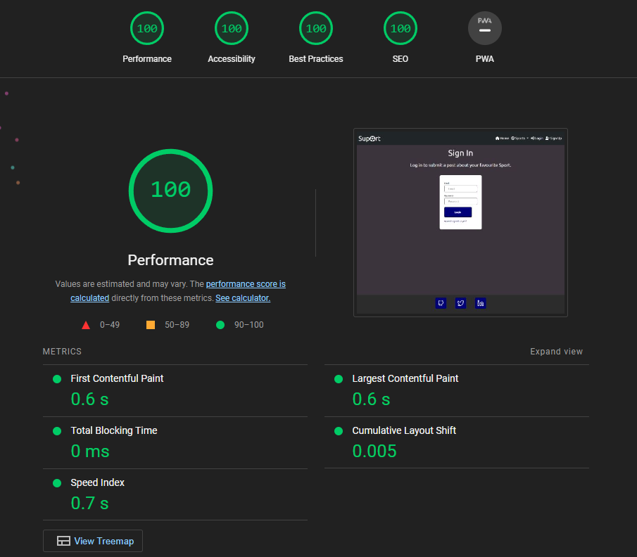  

Mobile  
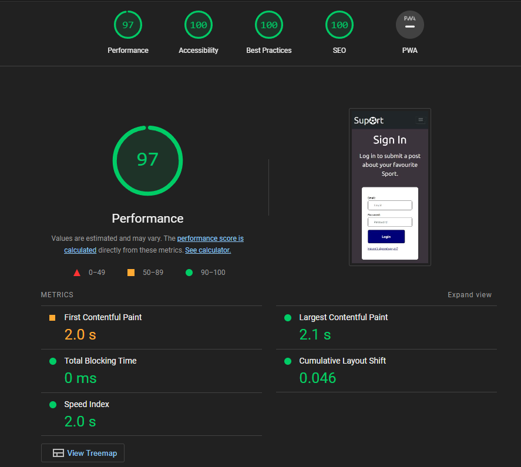  

**Overview**  
Desktop  
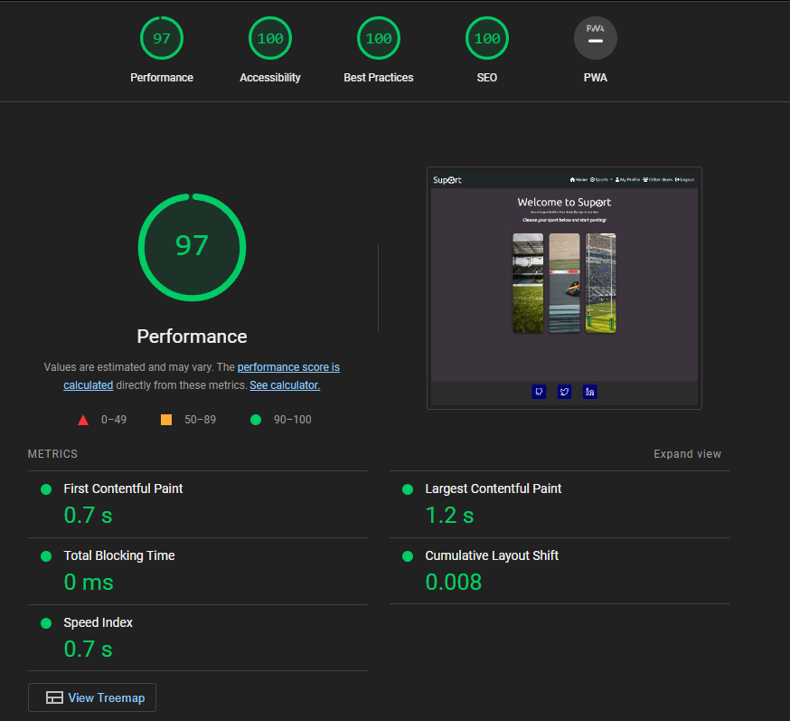  

Mobile  
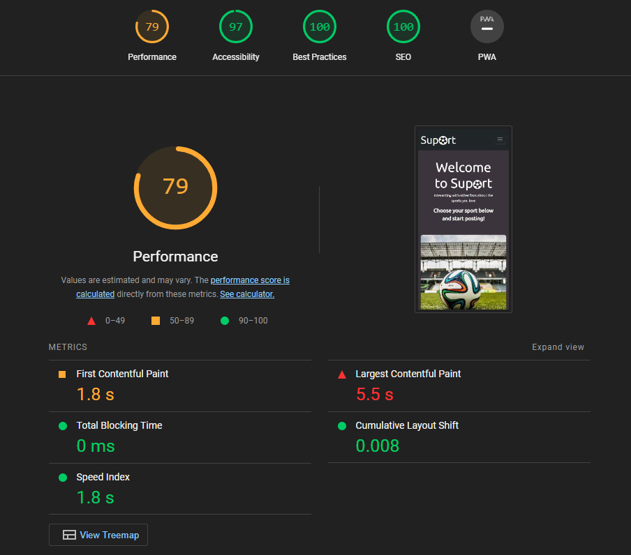  

**Football**  
Desktop  
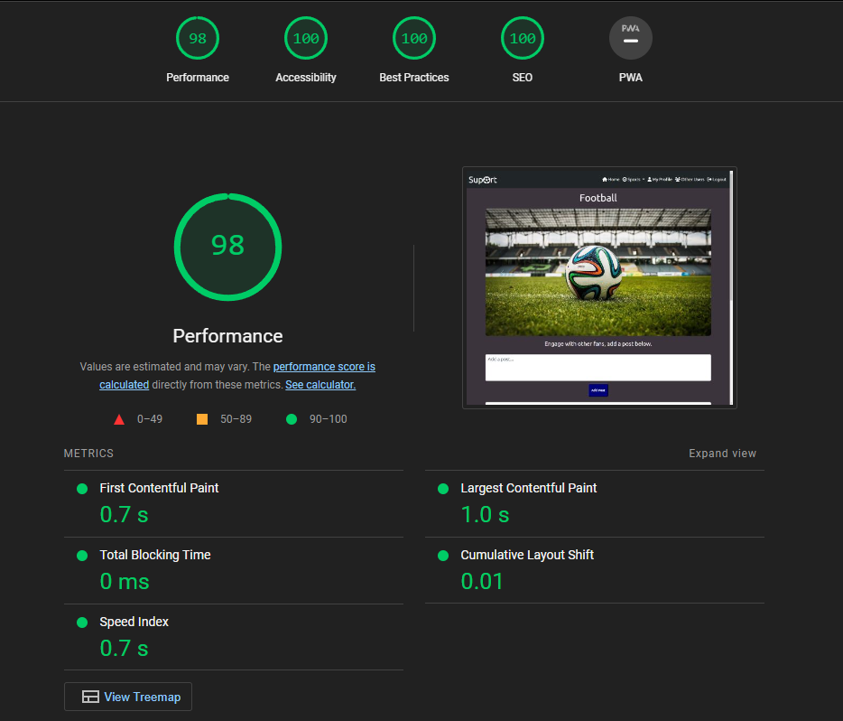  

Mobile  
  

**Formula 1**  
Desktop  
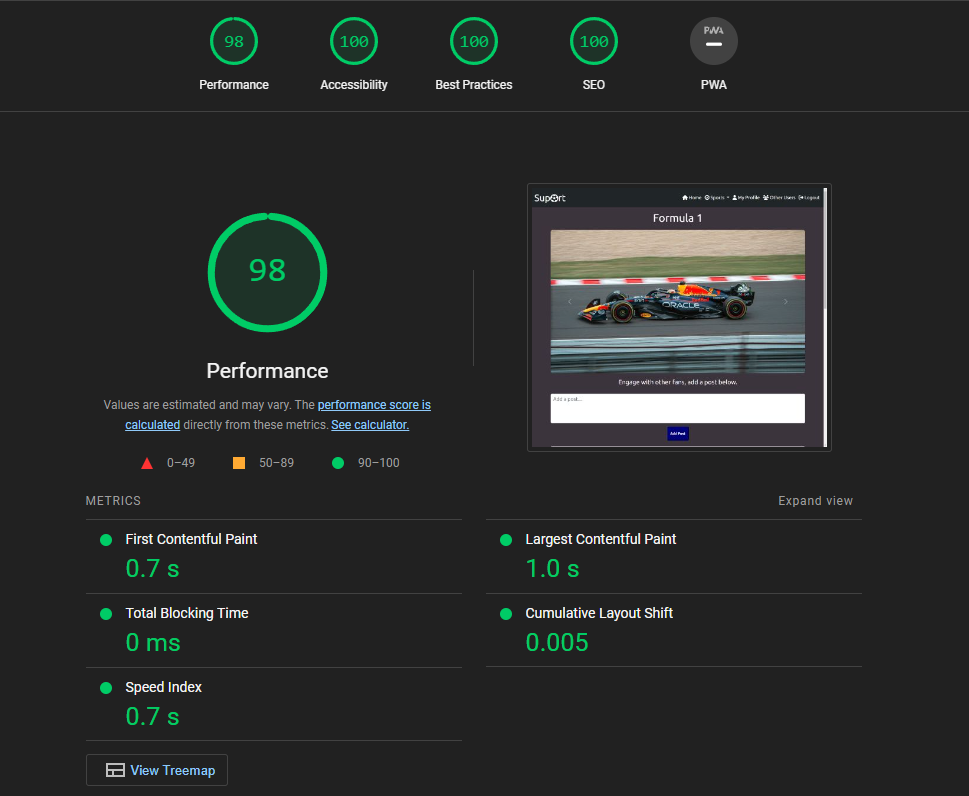  

Mobile  
  

**Rugby**  
Desktop  
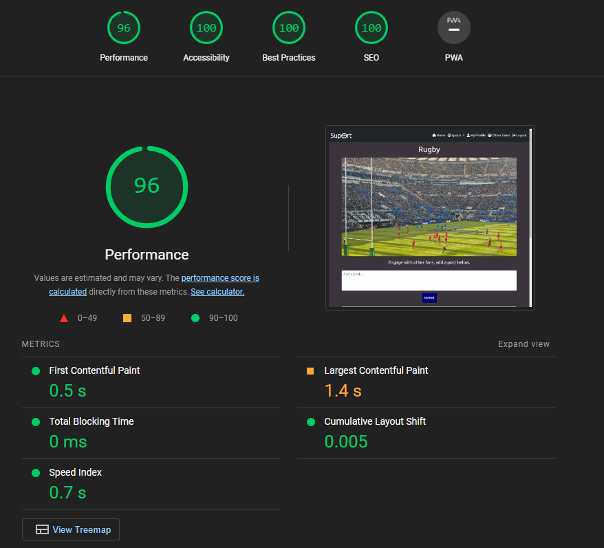  

Mobile  
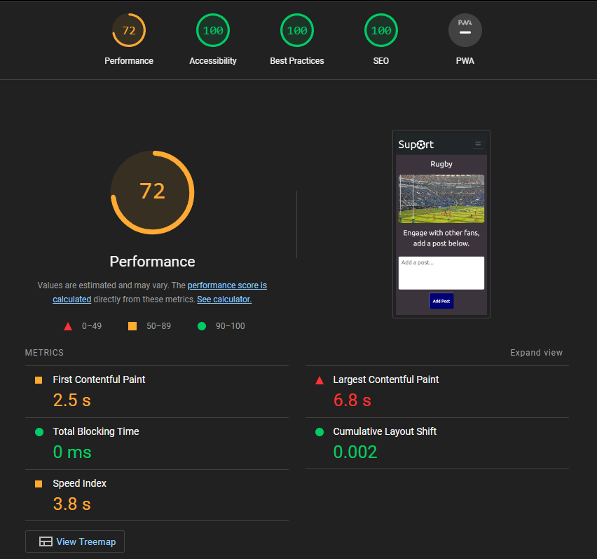  

**Profile**  
Desktop  
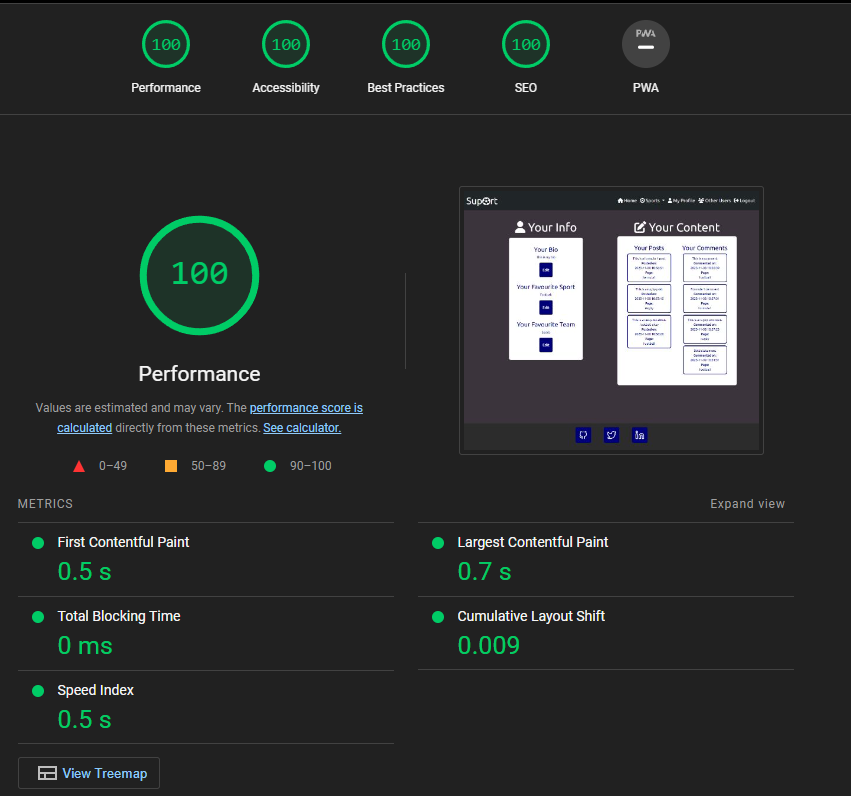  

Mobile  
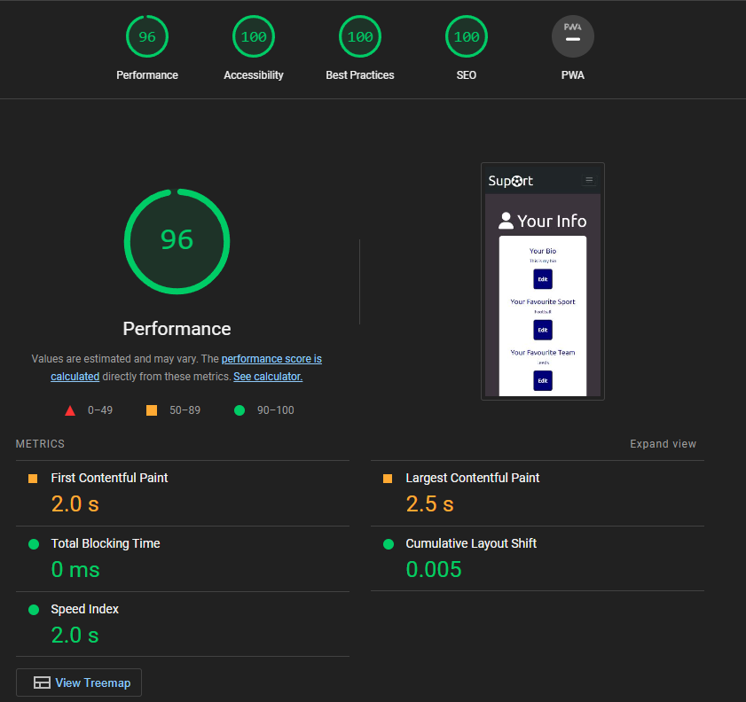  

**All Users**  
Desktop  
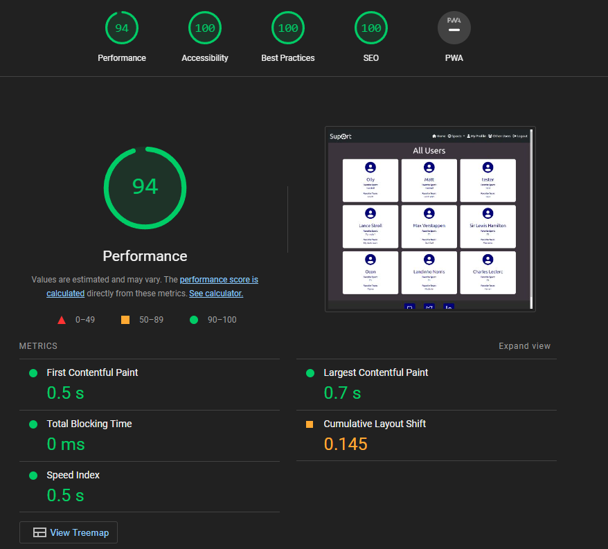  

Mobile  
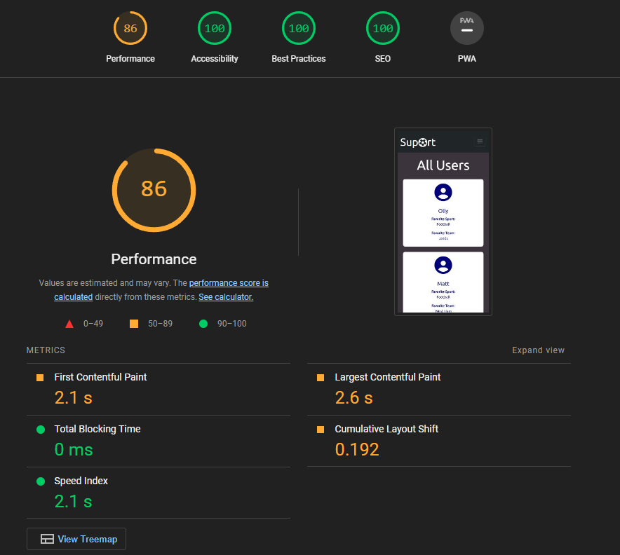  

## Browser Compatibility 
  
**Desktop**  

| Browser            | Version                                               | Bugs  |
| -------------      |:-------------:                                        | -----:|
| Google Chrome      | Version 112.0.5615.138 (Official Build) (64-bit)      | None  |
| Microsoft Edge     | Version 112.0.1722.58 (Official build) (64-bit)       | None  |
| Firefox            | 112.0.1 (64-bit)                                      | None  |  

**Mobile**  

| Device                   | Operating system | Bugs  |
| -------------            |:-------------:   | -----:|
| iPhone 14                | iOS 16.3.1       | None  |
| iPhone 14 pro            | iOS 16.0         | None  |
| iPad 10                  | iOS              | None  |

## Automatic Testing  
End point testing.  
Button testing tbc. 

## Manual Testing  
Navbar links.
Sign up.
Login.
Flash messages.
Overview cards.
Image carousels.
Post function. 
Edit Post.
Delete Post
Comment.
Delete Comment.
Edit Bio.
Edit fav team.
Edit fav sport.
save/cancel button.
Social media footer.
Delete modal.
Logout.

#### Functionality

**Usability**  

**Responsiveness**  

Breakpoints - bootstrap.

## Bug Reporting

[Back to README.md](https://github.com/ojalaw/suport_MP3)
